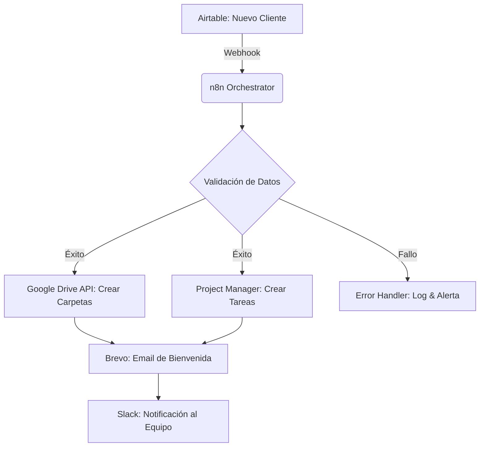

# 🚀 Automated Onboarding Orchestrator (n8n + GCP)

Este proyecto es un motor de automatización de grado empresarial diseñado para eliminar la fricción operativa durante el alta de nuevos clientes. Utiliza un modelo de Arquitectura Orientada a Eventos para sincronizar múltiples plataformas SaaS en tiempo real.

---

## 📋 El Problema
Las empresas pierden un promedio de 5 a 10 horas mensuales en tareas repetitivas de gestión de clientes: creación de carpetas, asignación de tareas en el gestor de proyectos y envío de kits de bienvenida. El error humano en estas etapas suele generar una mala primera impresión y retrasos operativos.

## 💡 La Solución
Un orquestador centralizado en n8n que reacciona a cambios en el CRM (Airtable) y ejecuta un flujo paralelo de aprovisionamiento de recursos:

- **Sincronización de Identidad**: Valida y normaliza datos del cliente.
- **Aprovisionamiento de Cloud Storage**: Crea estructuras jerárquicas en Google Drive.
- **Gestión de Flujo de Trabajo**: Crea tableros y tareas personalizadas en el Gestor de Proyectos.
- **Omnicanalidad**: Notifica al equipo interno y al cliente de forma simultánea.

---

## 🛠️ Stack Tecnológico

| Capa | Tecnología | Función |
| :--- | :--- | :--- |
| **Orquestador** | n8n (Self-hosted en GCP) | Motor de lógica y flujo de datos. |
| **Base de Datos / CRM** | Airtable | Fuente de verdad y disparador (Trigger). |
| **Infraestructura** | Google Cloud Platform | Hosting de la instancia y Google Drive API. |
| **Comunicaciones** | Brevo API / Gmail | Email transaccional dinámico. |
| **Gestión de Proyectos** | Trello / ClickUp | Creación de entregables y cronogramas. |

---

## 🏗️ Arquitectura del Sistema



---

## 🌟 Características de Ingeniería (Advanced Features)

- **Data Normalization**: Uso de nodos de código (JavaScript) para asegurar que los nombres de carpetas y correos sigan un estándar PascalCase o lowercase.
- **Error Handling (Fault Tolerance)**: El workflow incluye un nodo de "Error Trigger". Si una API externa falla, el sistema no se detiene; registra el error en una base de datos de control y notifica al administrador.
- **Modularidad**: El sistema está diseñado en sub-workflows reutilizables, permitiendo escalar a nuevos servicios (como Slack o Notion) sin reescribir la lógica principal.
- **Security First**: Todas las credenciales están gestionadas mediante el cifrado nativo de n8n y variables de entorno en el servidor de Google Cloud.

---

## 🚀 Instalación y Uso

1. **Clonar el repositorio**:
   ```bash
   git clone https://github.com/tu-usuario/onboarding-orchestrator.git
   ```

2. **Importar el Workflow**:
   Carga el archivo `/workflows/onboarding_main.json` en tu instancia de n8n.

3. **Configurar Variables de Entorno**:
   Configura las credenciales de API para Airtable, Google Cloud y Brevo.

4. **Trigger**:
   Configura el Webhook en Airtable para que apunte a la URL de producción de tu n8n.

---

## 🧔 Autor

**Anthony Villalobos**
- **LinkedIn**: [Tu Perfil]
- **Empresa**: TECNOANCON / Alma para Crear
- **Stack**: Programmer & Data Scientist