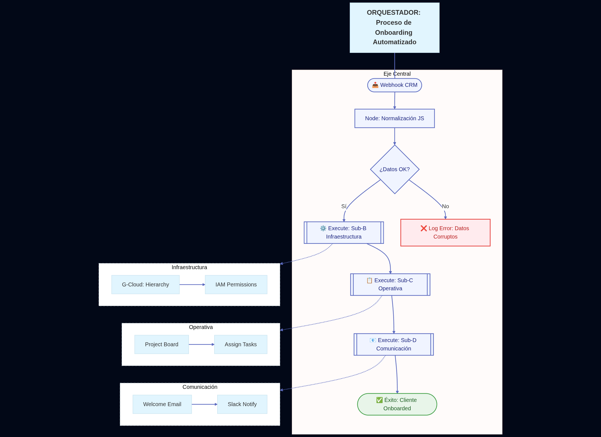

PRD: Orquestador de Onboarding Automatizado (n8n + GCP)

1. Visión del Proyecto

Crear un motor de integración centralizado que elimine el 100% de las tareas manuales tras la firma de un nuevo cliente o contrato, asegurando que el ecosistema digital del cliente (archivos, tareas y comunicación) esté listo en tiempo real.

2. Definición del Problema

Latencia: El tiempo entre la venta y el inicio del servicio se ve afectado por procesos administrativos manuales.

Inconsistencia: Errores en la nomenclatura de carpetas o falta de asignación de tareas críticas en el gestor de proyectos.

Falta de Trazabilidad: Dificultad para saber si el cliente recibió toda la información inicial necesaria.

3. Alcance y Funcionalidades (Scopes)

### ✅ Módulo A: Ingesta de Datos (COMPLETADO)
* Validación de Airtable, limpieza de datos y generación de Slugs.
* **Mejora:** Implementación de lógica "Fail Fast" (nodo If) para descartar registros sin email.
* **Error Handling:** Notificación a Discord si la validación falla (Rama False del If).

### ✅ Módulo B: Aprovisionamiento de Infraestructura (COMPLETADO)
* **Google Drive:** * Creación de carpeta raíz dentro de "ONboarding" (ID fijo).
    * Creación paralela de sub-carpetas (Contratos, Assets).
    * Asignación de permisos de edición al cliente (User: Email).

### ✅ Módulo C: Gestión Operativa (COMPLETADO)
* **Herramienta:** Trello.
* **Objetivo:** Crear tarjeta de cliente con checklist de onboarding y adjuntar links de Drive.
* **Actualización:** Se agrega un nodo de Airtable ("Add Drive Link") para guardar la URL de la carpeta generada en el registro original.

### ✅ Módulo D: Comunicación & Alertas (Discord + Gmail)(COMPLETADO)
* **Cliente (Gmail):** Envío automático de Kit de Bienvenida (HTML) con botón de acceso a Drive.
* **Equipo (Discord - Éxito):** Notificación en canal `#general` confirmando el onboarding exitoso.
* **Equipo (Discord - Alerta):** Notificación prioritaria en canal `#alertas` si el cliente no tiene email, solicitando intervención manual.

4. Stack Tecnológico Sugerido
Motor de Flujo: n8n (Self-hosted en Google Cloud Platform).

Lenguaje de Scripting: JavaScript (dentro de los nodos Code de n8n para transformaciones complejas).

Base de Datos de Estado (Opcional): Redis o una tabla en GCP para evitar duplicidad de ejecuciones.

Monitoreo: Integración con herramientas de logs para detectar fallos en los nodos.

5. Requerimientos No Funcionales
Manejo de Errores (Error Workflow): Si una API falla (ej. Google Drive está caído), el sistema debe reintentar o notificar al administrador sin detener el flujo completo.

Escalabilidad: Capacidad para manejar ráfagas de registros simultáneos mediante la configuración de colas en n8n.

Seguridad: Uso estricto de variables de entorno para las API Keys y OAuth2 para las conexiones con servicios externos.

